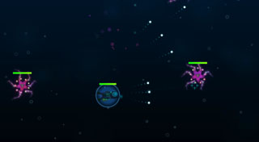
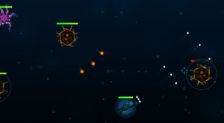
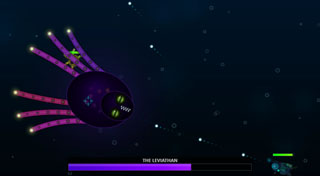

An interactive 2D underwater survival game built entirely in JavaScript. The project utilizes procedural generation to dynamically synthesize game music via code and renders all visual elements directly on the HTML5 Canvas without external art assets. Players navigate deep-sea environments to battle mutated alien fauna and defeat an ultimate Leviathan boss.<br>
```
Mouse   : Aim
LButton : Shoot
WASD    : Movement
```
<div style="display: flex; justify-content: space-between;">
  
  
  
</div>
